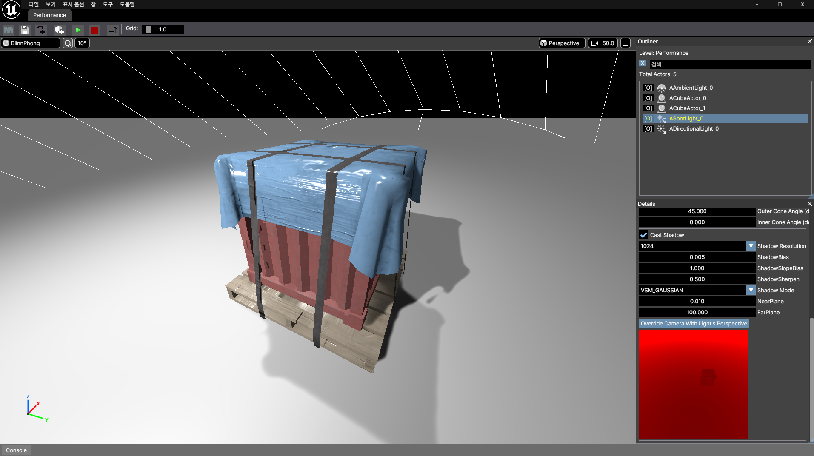
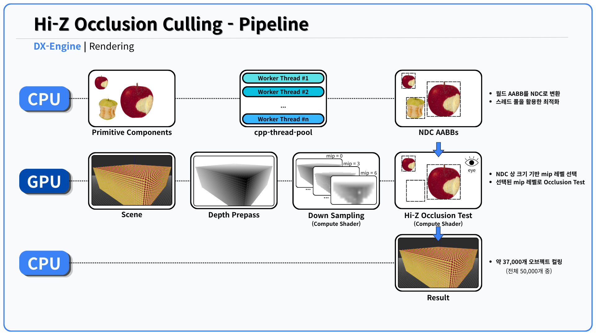
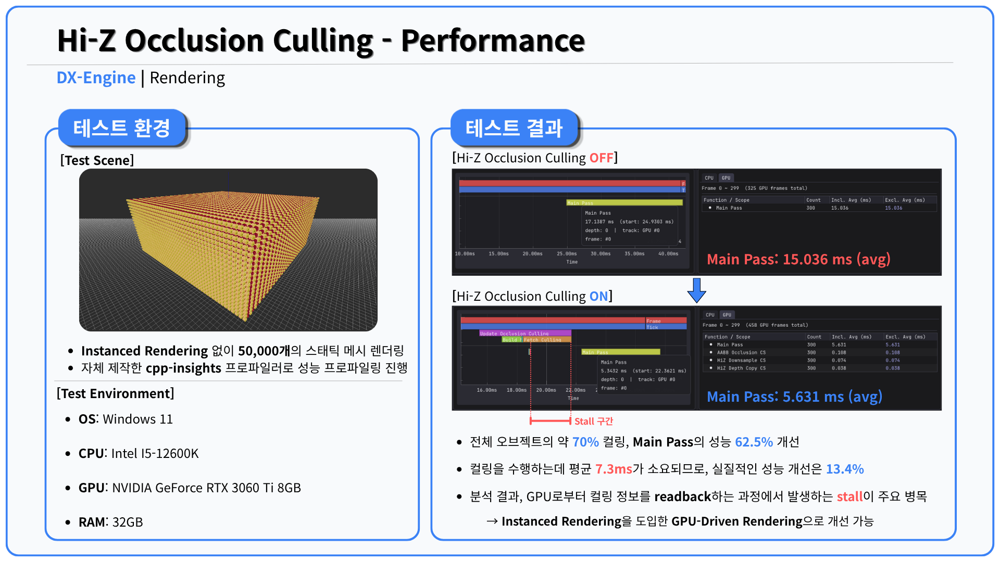
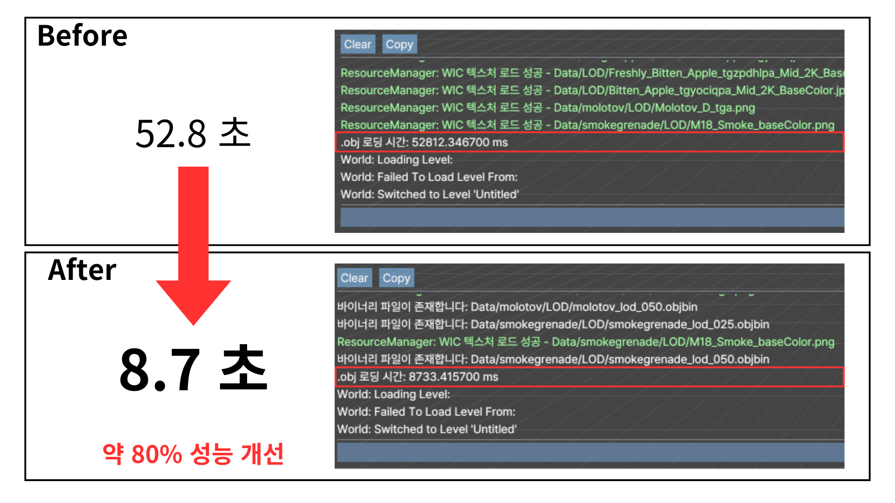
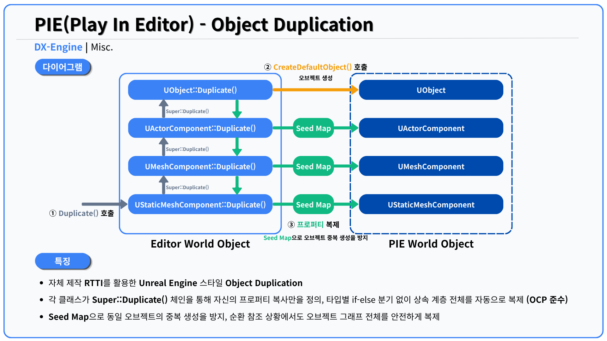

[← Main][link-main] | [Week 06 →][link-week06]



# DX-Engine — Week 05

> Hi-Z Occlusion Culling, OBJ/FArchive 파이프라인, PIE 복제 시스템, 커스텀 스레드 풀 라이브러리 구현


---

## Features

- **Hi-Z Occlusion Culling** — GPU Compute Shader 기반 Heirarchical Z Buffer Occlusion Culling
- **OBJ Importer + FArchive 바이너리 캐시** — 자체 구현 파서 + 바이너리 직렬화로 로딩 시간 단축
- **UObject 복제 시스템 (PIE)** — 자체제작 RTTI기반 Unreal Engine 스타일 에디터-PIE 월드 복제
- **cpp-thread-pool** — 스레드 풀 라이브러리 자체 제작 및 배포

---

## Key Systems

### Hi-Z Occlusion Culling

카메라에 보이지 않는 오브젝트를 GPU에서 직접 걸러내 불필요한 draw call을 줄인다.
매 프레임 Depth Buffer로 HiZ Mip Chain을 생성하고, 각 오브젝트의 AABB를 NDC 공간으로 변환한 뒤 적절한 Mip 레벨에서 가시성을 판단한다.





<details>
<summary><b>Technical Details — 클릭해서 펼치기</b></summary>

<br>

**Conservative Test의 원리**

세 가지 조건이 조합되어 false negative 없는 conservative culling을 보장한다.

**① Mip Chain — 최댓값 보존**
2×2 블록에서 최댓값(max)을 선택해 Mip Chain을 생성한다.
각 텍셀이 해당 영역에서 "가장 먼 깊이"를 보존하므로, HiZ 텍스처는 항상 occluder의 가장 보수적인 depth를 나타낸다.

**② Mip 레벨 선택 — 텍셀 크기 ≥ AABB**
`ceil(log2(max(w, h)))` 공식으로 AABB의 화면 픽셀 크기(w, h) 이상인 텍셀을 가진 Mip 레벨을 선택한다.
이 레벨에서 AABB는 최대 4개의 인접 텍셀에 걸칠 수 있다.

**③ 4코너 샘플링 — 경계 정렬 무관**
AABB가 텍셀 경계에 걸쳐있어도 4코너를 샘플링하면 AABB가 겹치는 모든 텍셀을 커버할 수 있다.
4샘플의 최댓값을 occluder depth로 사용하므로 conservative가 유지된다.

```
① max(2×2) → max(2×2) → ...   ← 가장 먼 깊이 보존
② ceil(log2(max(w,h))) Mip    ← 텍셀 1개 크기 ≥ AABB, 최대 4텍셀에 걸침
③ 4코너 max 샘플링            ← 걸쳐있는 모든 텍셀 커버

Z_min(AABB) > Z_max(HiZ 4코너)  →  Culled
Z_min(AABB) ≤ Z_max(HiZ 4코너)  →  Visible
```

**Mip Chain 생성에서 `Load` vs `SampleLevel`**

초기 구현의 `HiZDownSampleCS`는 UV 좌표 기반 `SampleLevel`로 2×2 블록의 최댓값을 선택했다.
UV→픽셀 좌표 변환 과정의 부동소수점 오차로 인접 픽셀을 잘못 읽는 문제가 있었고,
리팩터링 시 정수 좌표 직접 접근인 `Load`로 교체해 오차를 제거했다.
가시성 테스트(`HiZOcclusionCullingCS`)는 경계 부근 보간이 보수적 커버리지에 유리하므로 `SampleLevel`을 그대로 유지했다.

**GPU Readback Stall — 병목 분석**

현재 구조는 GPU 컬링 결과를 CPU로 읽어와 드로우콜을 선별하는 방식이다.
`FetchOcclusionCulling`에서 Staging Buffer Map 시 CPU가 GPU 완료를 동기적으로 대기하며 stall이 발생한다.

```
GPU(컬링) → CPU Readback(stall) → CPU가 드로우콜 선별 → GPU(렌더링)
```

부트캠프에서 수행했던 퍼포먼스 대회 조건으로 인해 Instanced Rendering 없이 개별 드로우콜로 처리해야 했으므로,
GPU Readback 기반 구조가 현재 조건에서의 최선이다.
Instanced Rendering 도입 시 GPU Driven Rendering으로 전환해 stall을 완전히 제거할 수 있다.

```
GPU(컬링) → Visibility Buffer → GPU가 Indirect Args 작성 → DrawIndirect → GPU(렌더링)
```

> 자세한 내용은 [블로그 글](https://velog.io/@geb0598/DX-Engine-Heirarchical-Z-Buffer-Occlusion-Culling)에서 확인할 수 있습니다.

</details>

---

### OBJ Importer + FArchive 바이너리 캐시

`.obj` 파일 파싱 결과를 첫 실행 시 `.objbin` 바이너리 파일로 캐싱한다.
이후 실행부터는 파싱을 건너뛰고 역직렬화만 수행해 로딩 시간을 단축한다.


*OBJ 파싱 52.8초 → 바이너리 역직렬화 8.7초 (약 80% 개선)*

<details>
<summary><b>Technical Details — 클릭해서 펼치기</b></summary>

<br>

**OBJ 파싱 핵심 — Vertex Deduplication**

OBJ 포맷은 위치/노멀/텍스쳐 좌표 인덱스를 분리해 저장하지만, GPU는 단일 인덱스 버퍼를 요구한다.
`(v, vn, vt)` 3-튜플을 키로 하는 해시맵으로 중복 버텍스를 제거하고 단일 인덱스 버퍼로 변환한다.

```cpp
using VertexKey = std::tuple<size_t, size_t, size_t>; // (position, normal, texcoord)
```

**FArchive 설계 — 단일 인터페이스 + 책임 분리**

Unreal Engine의 `FArchive`를 참고한 추상 이진 직렬화 시스템.
표준 C++의 `<<` / `>>` 분리 방식과 달리, `<<` 하나만 오버로딩하면 저장과 로드를 모두 처리한다.
이진 데이터는 쓴 순서 그대로 읽어야 하므로, 저장/로드 순서를 한 곳에서 정의하는 것이 오히려 안전하다.

```cpp
// 데이터 타입은 직렬화 순서만 정의
FArchive& operator<<(FArchive& Ar, FStaticMesh& Mesh) {
    Ar << Mesh.Vertices << Mesh.Indices << Mesh.Sections;
    return Ar;
}
// FWindowsBinWriter로 호출 → 저장
// FWindowsBinReader로 호출 → 로드 (동일한 코드)
```

책임은 세 계층으로 분리된다:
- `FArchive` (추상) — `IsLoading()`, `Serialize()` 인터페이스 정의
- `FWindowsBinWriter` / `FWindowsBinReader` — 플랫폼별 I/O 구현
- 데이터 타입 (`FStaticMesh` 등) — 직렬화 순서만 정의, I/O 로직 무관

새로운 타입을 추가할 때 I/O 코드를 건드릴 필요가 없고,
네트워크 I/O 같은 새로운 Archive를 추가해도 기존 타입 코드는 변경이 없다.

> 자세한 내용은 [블로그 글](https://velog.io/@geb0598/DX-Engine-%EC%A7%81%EB%A0%AC%ED%99%94)에서 확인할 수 있습니다.

</details>

---

### UObject 복제 시스템 (PIE)

에디터에서 Play 버튼을 누르면 현재 월드 전체를 복제해 독립된 PIE(Play-In-Editor) 월드를 생성한다.
게임 실행 중 원본 에디터 상태가 보존되며, 종료 시 그대로 복귀한다.

자체 구현한 RTTI를 활용한 UE 스타일 Object Duplication.
각 클래스가 `Super::Duplicate()` 체인을 통해 자신의 프로퍼티 복사만을 정의하고,
Seed Map으로 동일 오브젝트의 중복 복제를 방지해 오브젝트 그래프 전체를 안전하게 복사한다.



<details>
<summary><b>Technical Details — 클릭해서 펼치기</b></summary>

<br>

**자체 RTTI를 통한 상속 계층 복제**

`DECLARE_CLASS` / `IMPLEMENT_CLASS` 매크로로 구현한 자체 RTTI는 각 클래스가 정적 초기화 시점에 생성자 함수 포인터를 `UClass`에 등록한다. 덕분에 `DestClass->CreateDefaultObject()`만으로 런타임에 정확한 파생 타입을 인스턴스화할 수 있다.

복제는 `Super::Duplicate()` 체인으로 상속 계층을 끝까지 올라가 베이스(`UObject`)에서 객체를 생성하고, 반환되면서 각 계층이 자신이 아는 프로퍼티만 복사한다.

```
// 호출 흐름
UStaticMeshComponent::Duplicate(params)
    └→ Super::Duplicate(params)          // 위로 올라감
        └→ UObject::Duplicate(params)
              DupObject = DestClass->CreateDefaultObject()  // 파생 타입 그대로 생성
              return DupObject
        ← UMeshComponent: 자신의 프로퍼티 복사
    ← UStaticMeshComponent: 자신의 프로퍼티 복사 (LOD, Material 등)
```

각 클래스는 자기 계층의 프로퍼티만 책임지므로, 상속이 깊어져도 복제 로직이 각 클래스에 분산되어 유지보수가 쉽다.
새로운 컴포넌트 타입 추가 시 해당 클래스에만 `Duplicate()`를 구현하면 되며, 기존 코드 수정이 없다.

**DuplicationSeed — 순환 참조 방지**

Actor가 Component를 소유하고, Component가 다시 Actor를 참조하는 구조에서 단순 재귀 복제는 무한 루프에 빠진다. `DuplicationSeed` 맵이 이를 막는다.

```
// 순환 참조가 없으면?
A→Duplicate → B→Duplicate → A→Duplicate → B→Duplicate → ... (무한 루프)

// DuplicationSeed 적용
A→Duplicate
    DuplicationSeed[A] = A' 등록  ← 서브 오브젝트 복제 전에 먼저 등록
    B→Duplicate
        DuplicationSeed[B] = B' 등록
        A→Duplicate
            DuplicationSeed에 A' 존재 → A' 즉시 반환  ← 루프 차단
```

`CreateDefaultObject()`가 생성자에서 기본 컴포넌트를 이미 생성하는 문제도 같은 방식으로 해결한다. 생성된 기본 컴포넌트를 Seed에 미리 등록해두면 이후 복제 시 이중 생성 없이 재사용된다.

</details>

---

### cpp-thread-pool

C++17 기반의 스레드 풀 라이브러리. `Enqueue`, `ForEach`, `TransformReduce` API를 제공하며, 모든 callable을 작업으로 등록하고 `std::future`로 결과를 받을 수 있다. 크래프톤 정글 게임 테크랩 부트캠프 참여자들이 공통으로 사용할 수 있도록 독립 라이브러리로 제작해 배포했다.

> [cpp-thread-pool 레포지토리](https://github.com/geb0598/cpp-thread-pool)

**엔진 내 활용**

- **Hi-Z Occlusion Culling — NDCAABB 병렬 빌드**
  오브젝트 목록을 `hardware_concurrency()` 기준으로 청크 분할해 NDC 변환을 병렬 처리.
  각 워커 스레드가 로컬 구조체에만 쓰고 메인 스레드에서 병합하는 lock-free fork-join 패턴 적용.
  단일 스레드 대비 약 6배 개선 (6.0~6.5ms → 0.7~0.9ms, 28코어 기준).

- **오브젝트 피킹 — TransformReduce**
  `TransformReduce` API로 레이-AABB 교차 테스트를 병렬화해 최단 거리 오브젝트를 탐색.
  클릭 이벤트 시에만 실행되어 실질적인 성능 효과는 제한적이었다.

---

[← Main][link-main] | [Week 06 →][link-week06]

<!-- 링크 레퍼런스 -->
[link-main]: https://github.com/geb0598/DX-Engine
[link-week06]: https://github.com/geb0598/DX-Engine/tree/week-06
